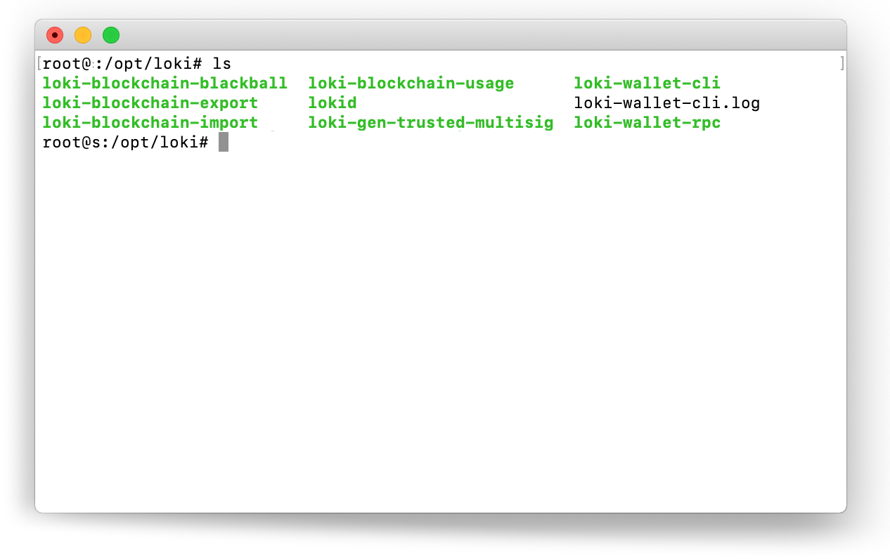
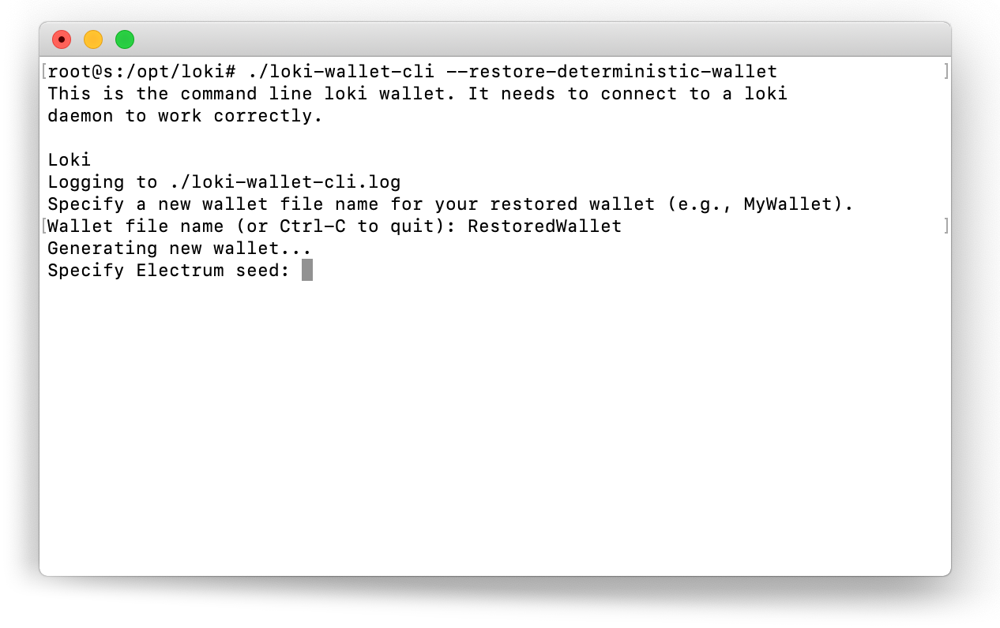

# Restoring Your CLI Wallet from Seed

To fully restore your wallet and be able to view balance and make transactions, having your seed stored will be enough. You don't need your wallet password or other keys to restore the wallet once you have a seed phrase.

## Step 1: Download and unzip CLI wallet

- Download the latest release of wallet CLI software for your desired operating system: [https://github.com/loki-project/loki/releases](https://github.com/loki-project/loki/releases)

- Unzip  `loki-[operating-system]-[platform]-[version].zip` file

<center></center>

## Step 2: Run wallet in restore mode

- Open a [Command Prompt](https://en.wikipedia.org/wiki/Cmd.exe) (Windows) or [Terminal](https://en.wikipedia.org/wiki/Terminal_emulator) (Linux / OSX) and navigate to the wallet folder

- Run wallet with `--restore-deterministic-wallet`  argument:
`./loki-wallet-cli --restore-deterministic-wallet`

## Step 3: Enter wallet name

You will be prompted to enter a wallet name and click [Enter]. You can enter any name here, use something rememberable and meaningful.

<center></center>

## Step 4: Enter your seed phrase

- You will be prompted to enter 25 word mnemonic seed you have stored. Paste it and press [Enter]. 

- If you have a seed encryption passphrase, enter it on the next step. Otherwise, press [Enter].

## Step 5: Enter wallet password

- You will be prompted for a password. Enter a new password that follows the [Password Policy](https://en.wikipedia.org/wiki/Password_policy) and press [Enter].

- Confirm password and press [Enter].

## Step 6: Specify a blockchain height

If you know the block height at which wallet was created or a first transaction was made, you can enter it here. Specifying a blockchain height will help to scan the wallet faster.

If you don't know a specific blockchain height, press [Enter] for scanning from block height 0.

## Step 7: Wait for the refresh process to finish

For refresh process to start, you need to have your daemon running. Another option would be to use a remote node. For that, use the following command, replacing <host> and <port> with the host and port number of the remote node you are connecting to:
	
```
./loki-wallet-cli --daemon-address <host>:<port>
```

Once refresh is done, you can use your full functioning restored wallet. Your public wallet address will remain the same.
